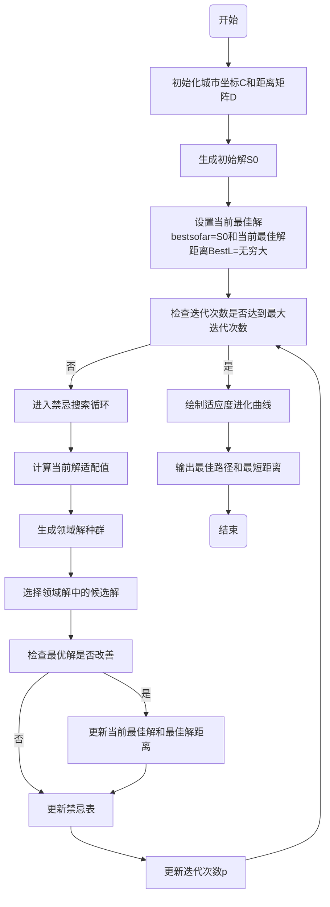

```mermaid
graph TD;
    Start(开始) --> Init[初始化城市坐标C和距离矩阵D]
    Init --> GenSol[生成初始解S0]
    GenSol --> SetBest[设置当前最佳解bestsofar=S0和当前最佳解距离BestL=无穷大]
    SetBest --> LoopCond[检查迭代次数是否达到最大迭代次数]
    LoopCond --> |否| SearchLoop[进入禁忌搜索循环]
    SearchLoop --> CalFit[计算当前解适配值]
    CalFit --> GenNeigh[生成领域解种群]
    GenNeigh --> SelectBest[选择领域解中的候选解]
    SelectBest --> CheckBest[检查最优解是否改善]
    CheckBest --> |是| UpdateBest[更新当前最佳解和最佳解距离]
    CheckBest --> |否| UpdateTabu[更新禁忌表]
    UpdateBest --> UpdateTabu
    UpdateTabu --> UpdateIter[更新迭代次数p]
    UpdateIter --> LoopCond
    LoopCond --> |是| PlotGraph[绘制适应度进化曲线]
    PlotGraph --> Output[输出最佳路径和最短距离]
    Output --> End(结束)

```

