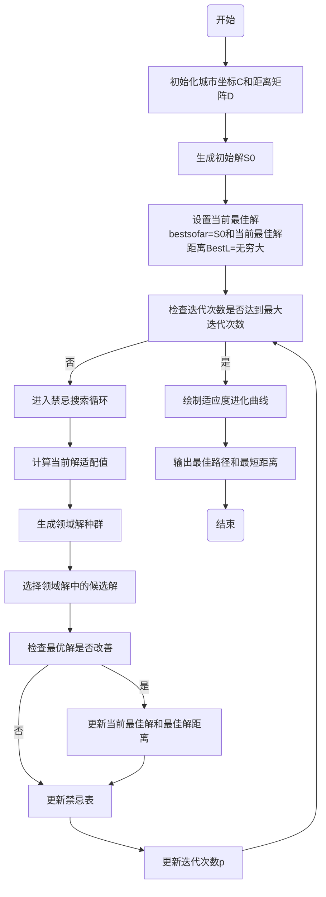

# 禁忌搜索解旅行商问题

## 禁忌搜索算法图

禁忌搜索特点是利用禁忌表来跳出局部最优解。

## 调节领域解

在禁忌搜索算法中，领域解的变化会对算法的性能产生重要影响。领域解的变化通常通过交换城市来实现，每次交换都会生成一个新的领域解。以下是领域解变化对算法性能的一些可能影响，并尝试以量化方式解释：

1. **解空间覆盖性**：领域解的变化可以增加对解空间的覆盖程度，使得算法能够更全面地搜索潜在的解。更广泛的解空间覆盖通常意味着更大的搜索空间，这可能会增加找到最优解的机会。
2. **局部搜索能力**：领域解的变化可以帮助算法摆脱局部最优解，因为它可以尝试不同的解决方案并找到更好的解。通过尝试多个领域解，算法可以更有可能找到全局最优解而不是陷入局部最优解。
3. **搜索速度**：领域解的数量和质量会影响算法的搜索速度。如果领域解的数量过多，可能会增加计算成本，导致算法运行时间较长。另一方面，如果领域解的数量太少，可能会限制算法的搜索能力，导致可能的最优解被忽略。56-72-89
4. **收敛性**：领域解的变化可以影响算法的收敛性，即算法是否能够在有限的迭代次数内收敛到一个较好的解。如果领域解的变化能够在每次迭代中提供足够的多样性和有效的搜索方向，那么算法更有可能在较短的时间内收敛到一个令人满意的解。
5. **最终解的质量**：领域解的变化直接影响最终得到的解的质量。如果领域解的变化能够引导算法朝着更优的方向前进，并且能够充分探索解空间，那么最终得到的解可能会更接近最优解。

要量化地评估领域解变化对算法性能的影响，你可以考虑以下几个指标：

- 搜索空间覆盖率：领域解的数量和多样性
- 算法收敛速度：算法达到收敛所需的迭代次数
- 最终解的质量：最终得到的解与全局最优解之间的差距
- 算法运行时间：算法完成求解所需的时间

通过对这些指标的定量评估，你可以更好地理解领域解变化对算法性能的影响，并根据需要对算法进行调整。

## 调节S0

66

**局部优化后作为初始解**：使用一些简单的启发式算法（如贪婪算法）生成一个初始解，然后对其进行局部优化（例如，通过交换相邻城市）来改善初始解。

## 调节Gmax

| Gmax         | 500  | 1000 | 2000 |
| ------------ | ---- | ---- | ---- |
| profile time | 30   | 72   | 190  |

## 调节禁忌表长

| TabuL        | round(0.5*(N*(N-1)/2)^0.5) | round(0.75*(N*(N-1)/2)^0.5) | round((N*(N-1)/2)^0.5) |
| ------------ | -------------------------- | --------------------------- | ---------------------- |
| profile time | 约70                       | 约70                        | 约70                   |

禁忌长度是禁忌搜索算法中的一个重要参数，它直接影响着算法的搜索能力和收敛速度。禁忌长度的变化会对实验结果产生以下影响：

1. **搜索空间覆盖度**：禁忌长度的增加可以增加算法对搜索空间的覆盖度，即在每次迭代中，算法能够考虑更多的解。这有助于提高算法找到全局最优解的概率。
2. **搜索速度**：一般来说，禁忌长度越长，算法的搜索速度就越慢。因为禁忌长度决定了算法记忆中保留的历史信息量，长禁忌长度会增加算法的计算复杂度和存储需求，导致搜索速度变慢。
3. **局部搜索能力**：适当增加禁忌长度可以增强算法的局部搜索能力，使得算法更容易跳出局部最优解，寻找到更优的解决方案。
4. **收敛性能**：禁忌长度的变化会影响算法的收敛速度和稳定性。通常情况下，合适的禁忌长度可以加快算法的收敛速度，使得算法更快地找到较优解。但是如果禁忌长度设置不当，可能会导致算法陷入局部最优解或者在搜索空间中徘徊。

综上所述，禁忌长度在实验结果中的影响主要体现在搜索空间覆盖度、搜索速度、局部搜索能力和收敛性能等方面。在进行实验时，需要综合考虑这些因素，选择合适的禁忌长度以达到较好的实验效果。通常情况下，可以通过实验和调优来确定最佳的禁忌长度。