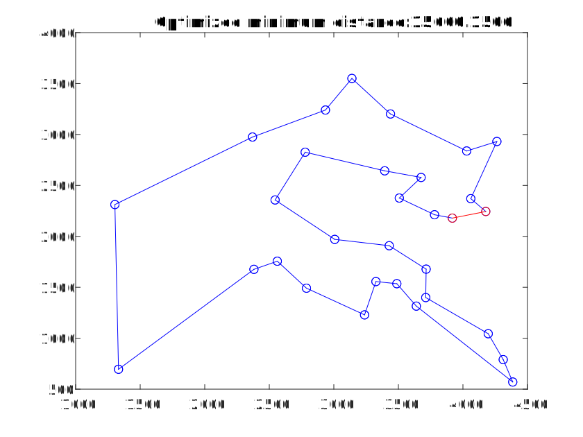
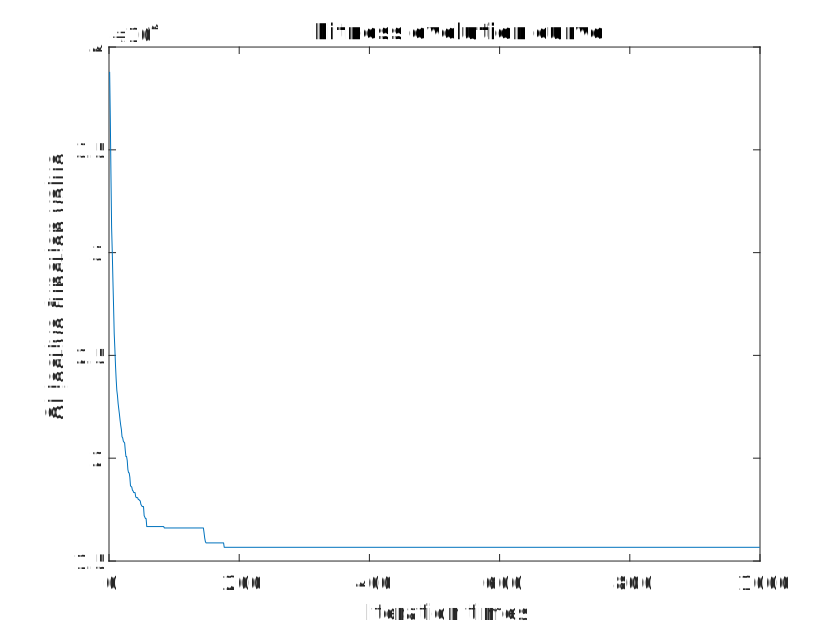
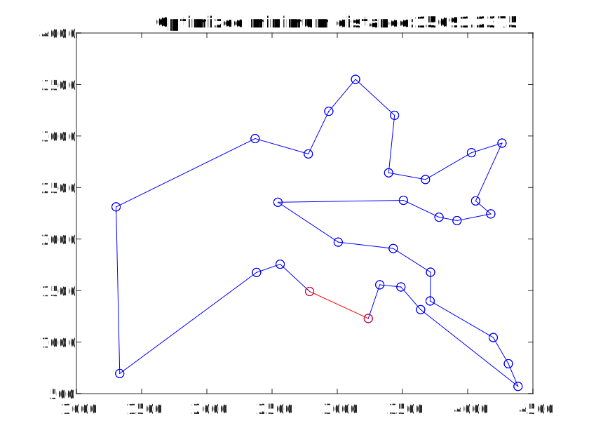
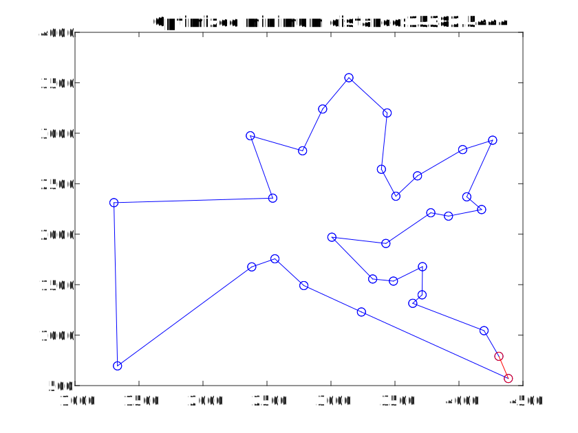

# 禁忌搜索解旅行商问题

## 禁忌搜索算法图

禁忌搜索的特点是利用禁忌表来避免重复访问先前搜索过的解，从而有助于跳出局部最优解。这意味着禁忌搜索不仅仅考虑当前最优解，还会考虑过去搜索过的解，以避免陷入局部最优解而无法找到全局最优解。通过记录禁忌表，禁忌搜索可以在搜索过程中避免重复探索相似的解，从而更有可能在搜索空间中探索到更优的解决方案。



初始参数：

```matlab
TabuL=round((N*(N-1)/2)^0.5);       %禁忌长度，固定为与问题规模相关的一个量
Ca=200;                             %领域解个数
S0=randperm(N);                     %随机产生初始解
Gmax=1000;  
```


## 单独调节领域解

以下是领域解变化对算法性能的一些可能影响：

1. **解空间覆盖性**：领域解的变化可以增加对解空间的覆盖程度，使得算法能够更全面地搜索潜在的解。更广泛的解空间覆盖通常意味着更大的搜索空间，这可能会增加找到最优解的机会。
2. **局部搜索能力**：领域解的变化可以帮助算法摆脱局部最优解，因为它可以尝试不同的解决方案并找到更好的解。通过尝试多个领域解，算法可以更有可能找到全局最优解而不是陷入局部最优解。
3. **搜索速度**：领域解的数量和质量会影响算法的搜索速度。如果领域解的数量过多，可能会增加计算成本，导致算法运行时间较长。另一方面，如果领域解的数量太少，可能会限制算法的搜索能力，导致可能的最优解被忽略。56-72-89
4. **收敛性**：领域解的变化可以影响算法的收敛性，即算法是否能够在有限的迭代次数内收敛到一个较好的解。如果领域解的变化能够在每次迭代中提供足够的多样性和有效的搜索方向，那么算法更有可能在较短的时间内收敛到一个令人满意的解。
5. **最终解的质量**：领域解的变化直接影响最终得到的解的质量。如果领域解的变化能够引导算法朝着更优的方向前进，并且能够充分探索解空间，那么最终得到的解可能会更接近最优解。

| Ca                         | 100                            | 200                         | 300                            |
| -------------------------- | ------------------------------ | --------------------------- | ------------------------------ |
| profile time               | 56                             | 72                          | 89                             |
| Optimized minimum distance |  |  |  |
| Fitness evolution curve    |  |  |  |


## 单独调节初始解

尝试使用贪婪算法生成一个初始解，然后对其进行局部优化来改善初始解。

实际效果一般。

|  |  |
| ------------------------------- | ------------------------------- |
| 与不生成初始解区别不大          | 经历数次飞跃达到局部最优        |


## 单独调节最大迭代次数

| Gmax                       | 500                               | 1000                        | 2000                              |
| -------------------------- | --------------------------------- | --------------------------- | --------------------------------- |
| profile time               | 30                                | 72                          | 190                               |
| Optimized minimum distance |  |  |  |
| Fitness evolution curve    |  |  |  |

## 单独调节禁忌表长
禁忌长度是禁忌搜索算法中的一个重要参数，它直接影响着算法的搜索能力和收敛速度。理论上禁忌长度的变化会对实验结果产生以下影响：

1. **搜索空间覆盖度**：禁忌长度的增加可以增加算法对搜索空间的覆盖度，即在每次迭代中，算法能够考虑更多的解。这有助于提高算法找到全局最优解的概率。
2. **搜索速度**：一般来说，禁忌长度越长，算法的搜索速度就越慢。因为禁忌长度决定了算法记忆中保留的历史信息量，长禁忌长度会增加算法的计算复杂度和存储需求，导致搜索速度变慢。
3. **局部搜索能力**：适当增加禁忌长度可以增强算法的局部搜索能力，使得算法更容易跳出局部最优解，寻找到更优的解决方案。
4. **收敛性能**：禁忌长度的变化会影响算法的收敛速度和稳定性。通常情况下，合适的禁忌长度可以加快算法的收敛速度，使得算法更快地找到较优解。但是如果禁忌长度设置不当，可能会导致算法陷入局部最优解或者在搜索空间中徘徊。

然而在实验中，可能由于调优范围过小，禁忌表长的改变并未造成搜索速度的明显提升：
| TabuL        | round(0.5*(N*(N-1)/2)^0.5) | round(0.75*(N*(N-1)/2)^0.5) | round((N*(N-1)/2)^0.5) |
| ------------ | -------------------------- | --------------------------- | ---------------------- |
| profile time | 约70                       | 约70                        | 约70                   |

## 参数综合调优

经过实验，以下参数已经较好地实现了优化：

```matlab
TabuL=round((N*(N-1)/2)^0.5);       %禁忌长度，固定为与问题规模相关的一个量
Ca=170;                             %领域解个数

% 使用贪婪算法生成初始解
S0 = greedyAlgorithm(C);

% 对初始解进行局部优化
S0 = localOptimization(D, S0);

Gmax=1200;                          %最大迭代次数   
```

|               |  |
| ---------------------------------------------- | --------------------------------- |
| 基本能确定出发城市在东侧时更容易得到全局最优解 | 搜索更容易跳出局部最优            |


## 参数自整定

profile time = 199s

```matlab
TabuL=round(0.5*(N*(N-1)/2)^0.5);   % 根据经验
Ca=ceil(3.7*N);                      % 根据经验

% 使用贪婪算法生成初始解
S0 = greedyAlgorithm(C);

% 对初始解进行局部优化
S0 = localOptimization(D, S0);

Gmax=3500;                          %最大迭代次数   
```

这种情况下进行多次尝试并且增加最大迭代次数利于得到全局最优：OMD出现过的最小值为15382.5444

| 尝试26                                   | 尝试27                                   |
| ---------------------------------------- | ---------------------------------------- |
|  |  |
|  |  |

对于禁忌搜索，参数自适应要求记录当前解适应度并更新领域解：

