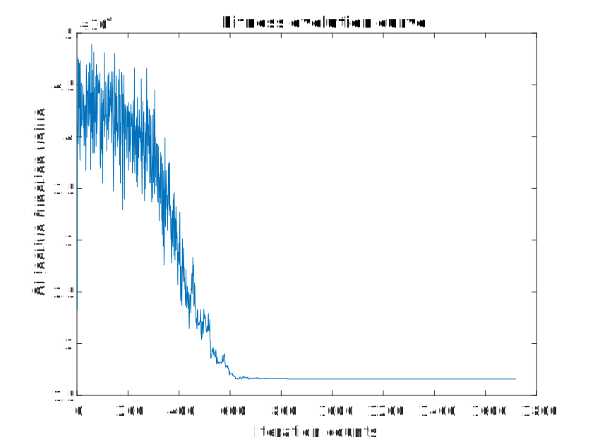
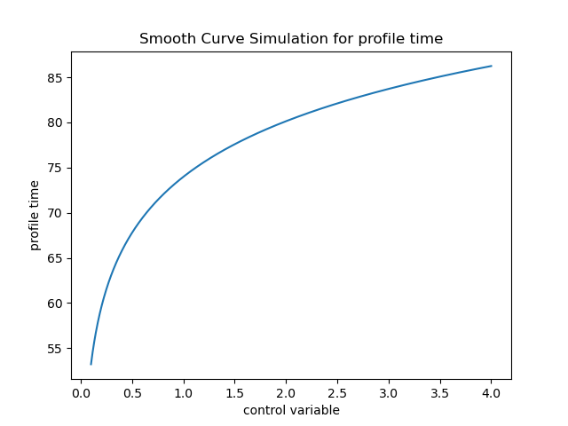
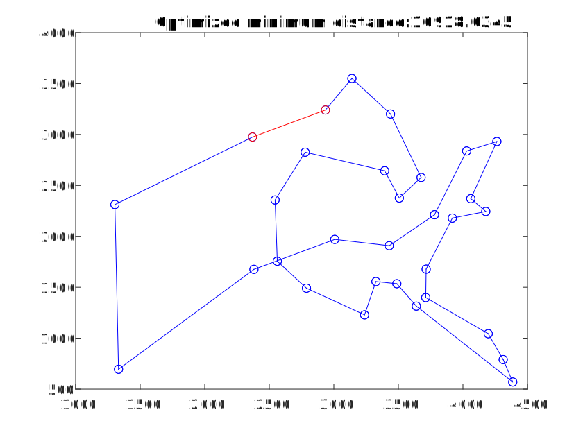

# 模拟退火解决旅行商问题

## 模拟退火算法图
模拟退火算法是一种启发式优化算法，受到物理中固体退火过程的启发而提出。它通过模拟金属固体在退火过程中的温度变化和分子运动，来寻找优化问题的解。模拟退火算法具有以下特点：

1. **全局搜索能力：** 模拟退火算法具有较强的全局搜索能力，能够在解空间中搜索到全局最优解或接近最优解，避免陷入局部最优解。
2. **接受概率机制：** 模拟退火算法通过接受状态变化的概率来跳出局部最优解，从而在搜索过程中对解空间进行探索。这个概率机制允许算法在搜索过程中以一定概率接受劣解，从而有助于避免陷入局部最优解。
3. **温度控制策略：** 模拟退火算法通过温度参数控制状态转移的概率，初始时温度较高，允许算法以较高的概率接受较差的解，随着搜索的进行，温度逐渐降低，减小接受劣解的概率，从而逐步接近最优解。
4. **自适应性：** 模拟退火算法具有一定的自适应性，可以根据问题的性质和搜索过程的情况调整温度参数和接受概率，使算法更好地适应不同的优化问题。


## 初始参数及效果

```
T=100*n; %初始温度 
L=100; %马可夫链长度 
K=0.99; %衰减参数 
delta_e=len2-len1; 
delta_e = delta_e*1; %能量差倍率(自己加的参数)
T>0.001 %停止迭代温度
```


从适应度曲线不难看出，在迭代前期(温度较高时)退火目标函数值震荡幅度较大，亦即算法更易跳出局部最优解；随着退火过程的进行，目标函数值震荡幅度减少且波动下降，说明该条件下算法更难接受劣解。

## 调节初始温度

1. **局部搜索能力：** 较高的初始温度意味着更容易接受劣解，因此有利于算法跳出局部最优解。在初始温度较高的情况下，算法更可能接受随机的状态转移，从而增加了搜索的多样性，有利于全局搜索。
2. **收敛速度：** 较低的初始温度会导致算法更难接受劣解/拒绝随机的状态转移，因此有利于算法快速收敛到局部最优解附近。
3. **全局搜索与局部搜索的平衡：** 较高的初始温度会偏向于全局搜索，而较低的初始温度会偏向于局部搜索。

通过随机试验代码得到以下结果：

| T              | 1*n                    | 10*n                    | 200*n                    | 300*n                    | 1000*n                    |
| -------------- | ---------------------- | ----------------------- | ------------------------ | ------------------------ | ------------------------- |
| profile time/s | 74                     | 94                      | 121                      | 121                      | 134                       |
| OMD            |  |  |  |  |  |
| FEC            |  |  |  |  |  |



随着初始温度的增大，虽然收敛时间变长，但是搜索范围的限制并不能使算法的全局搜索性能变强，同时不难看出随机收敛的结果并没有因为初始温度的增加而显著下降。

## 单独调节冷却率(衰减参数)

1. **收敛速度：** 冷却率决定了温度如何随时间或迭代次数而下降。较快的冷却率会使温度迅速下降，从而加快算法的收敛速度；而较慢的冷却率会使温度下降缓慢，导致算法收敛速度较慢。

2. **全局搜索能力与局部搜索能力的平衡：** 较快的冷却率会降低算法接受劣解的概率，使得算法更容易陷入局部最优解；而较慢的冷却率会增加算法接受劣解的概率，有利于跳出局部最优解，进行全局搜索。

3. **稳定性：** 较快的冷却率可能会导致算法在早期迭代阶段就过早收敛到局部最优解附近，而较慢的冷却率可能会导致算法在后期迭代阶段仍然保持较高的温度，难以收敛到最优解。

4. **搜索空间覆盖能力：** 较快的冷却率会使算法在每个温度下进行的状态转移次数较少，可能导致搜索空间覆盖不足；而较慢的冷却率会增加每个温度下的状态转移次数，有助于增加搜索空间的覆盖能力

   通过随机试验代码得到以下结果：

   | K              | 0.49                     | 0.69                     | 0.79                     | 0.999                     |
| -------------- | ------------------------ | ------------------------ | ------------------------ | ------------------------- |
   | profile time/s | 2                        | 5                        | 6                        | 995+                      |
| OMD            |  |  |  |  |
   | FEC            |  |  |  |  |

   
   
   不难看出，随着衰减参数的增大，算法迭代时间以近似对数关系增大，前期震荡逐渐明显，说明算法全局搜索能力变强。

## 单独调节马尔科夫链长度

1. **搜索深度：** 马尔可夫链长度决定了在每个温度下进行的状态转移次数，即算法在每个温度下进行的搜索深度。增加马尔可夫链长度可以增加算法的搜索深度，使其能够更充分地探索当前温度下的解空间，有利于发现更优的解。相反，减小马尔可夫链长度会降低搜索深度，可能导致算法在每个温度下搜索不够充分，从而影响解的质量。
2. **计算开销：** 增加马尔可夫链长度会增加算法的计算开销，因为算法需要进行更多次的状态转移操作。特别是在处理大规模问题时，较长的马尔可夫链长度可能会导致算法的计算时间增加，从而影响算法的效率。
3. **全局搜索能力与局部搜索能力的平衡：** 增加马尔可夫链长度可以增加算法的全局搜索能力，有助于跳出局部最优解，进行全局搜索。相反，减小马尔可夫链长度会降低算法的全局搜索能力，使其更容易陷入局部最优解。因此，调节马尔可夫链长度可以影响算法全局搜索能力与局部搜索能力的平衡。
4. **稳定性：** 较长的马尔可夫链长度可能会使算法更容易跳出局部最优解，但也可能导致算法在搜索过程中不稳定，容易受到随机性的影响。相反，较短的马尔可夫链长度可能会使算法更容易收敛到局部最优解，但也可能导致算法过早收敛或者陷入局部最优解。因此，在调节马尔可夫链长度时需要考虑到算法的稳定性。

通过随机试验代码得到以下结果：

| L              | 50                      | 75                      | 125                      | 150                      |
| -------------- | ----------------------- | ----------------------- | ------------------------ | ------------------------ |
| profile time/s | 104                     | 113                     | 122                      | 125                      |
| OMD            |  |  |  |  |
| FEC            |  |  |  |  |


在同量级的马尔可夫长度下运算时间和搜索效果并无明显区别，后面的“综合调优”部分会指出不同量级的马尔可夫长度对收敛结果的影响。

## 单独调节能量差参数

1. **接受劣解的概率：** 能量差参数用于计算状态转移的能量差，影响了接受劣解的概率。增大能量差参数会增加接受劣解的概率，使得算法更容易接受劣解；而减小能量差参数会减小接受劣解的概率，使得算法更不容易接受劣解。
2. **全局搜索能力与局部搜索能力的平衡：** 增大能量差参数会增加接受劣解的概率，有利于跳出局部最优解，进行全局搜索。相反，减小能量差参数会减小接受劣解的概率，使得算法更容易陷入局部最优解。
3. **收敛速度：** 增大能量差参数会增加接受劣解的概率，有利于跳出局部最优解，但也可能导致算法收敛速度较慢；而减小能量差参数会减小接受劣解的概率，加快算法收敛速度，但可能会陷入局部最优解。
4. **稳定性：** 较大的能量差参数可能会使算法更容易跳出局部最优解，但也可能导致算法在搜索过程中不稳定，容易受到随机性的影响。相反，较小的能量差参数可能会使算法更容易收敛到局部最优解，但也可能导致算法过早收敛或者陷入局部最优解。

通过随机试验代码得到以下结果：

| delta_e *=     | 0.1                           | 0.5                           | 10                            |
| -------------- | ----------------------------- | ----------------------------- | ----------------------------- |
| profile time/s | 117                           | 113                           | 116                           |
| OMD            |  |  |  |
| FEC            |  |  |  |


不难得出，能量差参数对于代码运行的时间几乎没有影响(从代码看并不控制步长)，但在实际收敛趋势上，较高的能量差倍率能在收敛前期减少接受劣解的概率(代码中作为指数调节)。

## 单独调节终止条件

这一步其实可以归结为收敛总步长的调节，和初始温度、冷却率共同作用。

## 综合调优参数及效果

```
T=400*n; %初始温度 
L=1500; %马可夫链长度 
K=0.99; %衰减参数 
delta_e=len2-len1; 
delta_e = delta_e*20; %能量差倍率(自己加的参数)
T>0.001 %停止迭代温度
```

该参数能在很大概率上使得总路程稳定收敛到15600以下，此处不放效果图。收敛效果依赖初始解。

## 代码实现

```matlab
%%%%%%%%%%%%%%%%%%%%%%模拟退火算法解决 TSP 问题%%%%%%%%%%%%%%%%%%%%%%% 

%%%%%%%%%%%%%%%%%%%%%%%%%%%%%初始化%%%%%%%%%%%%%%%%%%%%%%%%%%%%%%%% 
clear all; %清除所有变量 
close all; %清图 
clc; %清屏 

% 定义城市坐标
C=[1304 2312;3639 1315;4177 2244;3712 1399;3488 1535;3326 1556;... 
 3238 1229;4196 1044;4312 790;4386 570;3007 1970;2562 1756;... 
 2788 1491;2381 1676;1332 695;3715 1678;3918 2179;4061 2370;... 
 3780 2212;3676 2578;4029 2838;4263 2931;3429 1908;3507 2376;... 
 3394 2643;3439 3201;2935 3240;3140 3550;2545 2357;2778 2826;... 
 2370 2975]; %31 个省会城市坐标 

n=size(C,1); %TSP 问题的规模,即城市数目 
T=100*n; %初始温度 
L=100; %马可夫链长度 
K=0.99; %衰减参数 

%%%%%%%%%%%%%%%%%%%%%%%%%%%%%城市坐标结构体%%%%%%%%%%%%%%%%%%%%%%%%%% 
city=struct([]); 
for i=1:n 
 city(i).x=C(i,1); 
 city(i).y=C(i,2); 
end 

l=1; %统计迭代次数 
len(l)=func3(city,n); %每次迭代后的路线长度 

figure(1); 
while T>0.001 %停止迭代温度 
 %%%%%%%%%%%%%%%%多次迭代扰动，温度降低之前多次实验%%%%%%%%%%%%%%% 
 for i=1:L 
     %%%%%%%%%%%%%%%%%%%计算原路线总距离%%%%%%%%%%%%%%%%%%%%%%%%% 
     len1=func3(city,n); 
     %%%%%%%%%%%%%%%%%%%%%%%%%产生随机扰动%%%%%%%%%%%%%%%%%%%%%%% 
     %%%%%%%%%%%%%%%%随机置换两个不同的城市的坐标%%%%%%%%%%%%%%%%% 
     p1=floor(1+n*rand()); 
     p2=floor(1+n*rand()); 
     while p1==p2 
         p1=floor(1+n*rand()); 
         p2=floor(1+n*rand()); 
     end 
     tmp_city=city; 
     tmp=tmp_city(p1); 
     tmp_city(p1)=tmp_city(p2); 
     tmp_city(p2)=tmp; 
     %%%%%%%%%%%%%%%%%%%%%%%%计算新路线总距离%%%%%%%%%%%%%%%%%%%% 
     len2=func3(tmp_city,n); 
     %%%%%%%%%%%%%%%%%%新老距离的差值，相当于能量%%%%%%%%%%%%%%%%%  
     delta_e=len2-len1; 
     delta_e = delta_e*100;
     %%%%%%%%%%%%新路线好于旧路线，用新路线代替旧路线%%%%%%%%%%%%%% 
     if delta_e<0 
         city=tmp_city; 
     else 
         %%%%%%%%%%%%%%%%%%以概率选择是否接受新解%%%%%%%%%%%%%%%%% 
         if exp(-delta_e/T)>rand() 
             city=tmp_city; 
         end 
     end 
 end 

 l=l+1; 
 %%%%%%%%%%%%%%%%%%%%%%%%%计算新路线距离%%%%%%%%%%%%%%%%%%%%%%%%%% 
 len(l)=func3(city,n); 
 %%%%%%%%%%%%%%%%%%%%%%%%%%%温度不断下降%%%%%%%%%%%%%%%%%%%%%%%%%% 
 T=T*K; 

 for i=1:n-1 
     plot([city(i).x,city(i+1).x],[city(i).y,city(i+1).y],'bo-'); 
     hold on; 
 end 
 plot([city(n).x,city(1).x],[city(n).y,city(1).y],'ro-'); 
 title(['Optimized minimum distance:',num2str(len(l))]); 
 hold off; 
 pause(0.005); 
end 

figure(2); 
plot(len) 
xlabel('Iteration counts') 
ylabel('Objective function value') 
title('Fitness evolution curve') 

%%%%%%%%%%%%%%%%%%%%%%%%%%%%适值函数%%%%%%%%%%%%%%%%%%%%%%%% 
function len=func3(city,n) 
len=0; 
for i=1:n-1 
 len=len+sqrt((city(i).x-city(i+1).x)^2+(city(i).y-city(i+1).y)^2); 
end 
len=len+sqrt((city(n).x-city(1).x)^2+(city(n).y-city(1).y)^2); 
end
```

