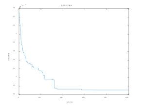

# GA

## 标准遗传算法求函数极值

最终参数和代码，目标函数值为24.855363

```matlab
%%%%%%%%%%%%%%%%%%%%标准遗传算法求函数极值%%%%%%%%%%%%%%%%%%%
%%%%%%%%%%%%%%%%%%%%%%%%初始化参数%%%%%%%%%%%%%%%%%%%%%%%%%% 
clear all; %清除所有变量 
close all; %清图 
clc; %清屏 
NP = 500; %种群数量 
L = 20; %二进制数串长度 
Pc = 0.4; %交叉率 
Pm = 0.2; %变异率 
G = 50; %最大遗传代数 
Xs = 10; %上限 
Xx = 0; %下限 

```


参数对算法性能的影响

1. 种群大小（NP）**：
   - 增加种群大小可能会增加算法的搜索范围，提高全局搜索能力，但会增加计算成本。
   - 减小种群大小可能会减少计算成本，但搜索能力可能会受限。
2. **迭代次数（G）**：
   - 增加迭代次数可能会增加算法的搜索时间，有助于更好地探索解空间，尤其对于复杂的问题。
   - 减少迭代次数可能会减少计算成本，但可能无法获得足够优秀的解。
3. **交叉率（Pc）**：
   - 增加交叉率可能会增加种群的多样性，有助于保持种群的多样性，但如果设置过高，可能会导致早熟收敛。
   - 减小交叉率可能会减少种群的多样性，但有助于保留更好的个体。
4. **变异率（Pm）**：
   - 增加变异率可能会增加算法的局部搜索能力，有助于跳出局部最优解，但如果设置过高，可能会破坏种群的优秀个体。
   - 减小变异率可能会减少算法的局部搜索能力，但有助于保留更好的个体。

## 实值遗传算法求函数极值

```matlab
%%%%%%%%%%%%%%%%%%%%实值遗传算法求函数极值%%%%%%%%%%%%%%%%%%%%% 
%%%%%%%%%%%%%%%%%%%%%%%%%%%初始化%%%%%%%%%%%%%%%%%%%%%%%%%%%%% 
clear all; %清除所有变量 
close all; %清图 
clc; %清屏 
D = 10; %基因数目 
NP = 100; %染色体数目 
Xs = 20; %上限 
Xx = -20; %下限 
G = 1000; %最大遗传代数 
f = zeros(D, NP); %初始种群赋空间 
nf = zeros(D, NP); %子种群赋空间 
Pc = 0.8; %交叉概率 
Pm = 0.1; %变异概率 
```

对比君主选择(0.000371)和轮盘赌选择(0.003463)
君主选择可以加速算法的收敛速度，特别是当优秀个体的适应度较高且不易被突变或交叉改变时，君主选择有助于保留这些优秀个体，加快收敛速度；轮盘赌选择具有一定的随机性，适应度高的个体被选中的概率更大但并不是绝对的。这种选择策略有助于维持种群的多样性，有时可以避免陷入局部最优解，但也可能导致较差的个体被选择。

只变异不交叉：0.001197
"随机搜索"方法。在这种情况下，算法主要通过随机地对个体的基因进行变异来探索解空间，但没有了交叉操作的引入，种群中的个体之间没有了基因的混合，也就无法利用个体之间的信息交流。

只交叉不变异：73.450074
"局部搜索"方法。在这种情况下，算法主要通过个体之间的基因交换来探索解空间，但由于没有引入随机性的变异操作，可能会陷入局部最优解，并且在搜索空间中无法跳出局部极值点。

## 遗传算法解决 TSP 问题

探讨多种交叉方法对于算法性能的影响

---


1. **PMX（部分匹配交叉）**：
   - PMX 交叉保留了父代中的部分结构，因此更有可能保留一些良好的性状。
   
   - PMX 交叉可以有效地保持子代的多样性，因为它将保留父代中的部分路径，而不是完全交换路径。这可能导致更大的收敛速度和更好的全局探索能力。
   
   - PMX 交叉的主要缺点是它可能会导致一些路径中的重复节点，需要进行额外的处理来解决这些冲突。
   
   - ```matlab
     function [A, B] = PMX(A, B)
         N = length(A);
         % 随机选择交叉的两个点
         p1 = randi([1, N]);
         p2 = randi([1, N]);
         while p1 == p2
             p2 = randi([1, N]);
         end
         
         % 确保 p1 < p2
         if p1 > p2
             temp = p1;
             p1 = p2;
             p2 = temp;
         end
         
         % PMX交叉
         tempA = A;
         tempB = B;
         A(p1:p2) = tempB(p1:p2);
         B(p1:p2) = tempA(p1:p2);
         
         for i = 1:N
             if i < p1 || i > p2
                 % 处理冲突
                 while ismember(tempA(i), A(p1:p2))
                     idx = find(tempA == tempB(i));
                     tempA(i) = tempA(idx);
                 end
                 while ismember(tempB(i), B(p1:p2))
                     idx = find(tempB == tempA(i));
                     tempB(i) = tempB(idx);
                 end
             end
         end
     end
     
     ```
   
     
2. **OX（顺序交叉）**：
   - OX 交叉是一种简单而有效的交叉方式，它保留了父代的顺序结构，但交换了部分路径。
   
   - OX 交叉可以保持子代的多样性，但可能会导致一些局部最优解，因为它只是部分地交换了路径，而不是完全重组。
   
   - OX 交叉相对简单，计算开销较低，但在某些情况下可能会导致较慢的收敛速度。
   
   - ```matlab
     function [A, B] = OX(A, B)
         N = length(A);
         % 随机选择交叉的两个点
         p1 = randi([1, N]);
         p2 = randi([1, N]);
         while p1 == p2
             p2 = randi([1, N]);
         end
         
         % 确保 p1 < p2
         if p1 > p2
             temp = p1;
             p1 = p2;
             p2 = temp;
         end
         
         % 保留中间部分
         middleA = A(p1:p2);
         middleB = B(p1:p2);
         
         % 交换非中间部分
         A(p1:p2) = middleB;
         B(p1:p2) = middleA;
         
         % 处理剩余部分
         restA = setdiff(B, middleA);
         restB = setdiff(A, middleB);
         lenRestA = length(restA);
         lenRestB = length(restB);
         if p1 > 1
             A(1:p1-1) = restA(1:min(p1-1, lenRestA));
             B(1:p1-1) = restB(1:min(p1-1, lenRestB));
         end
         if p2 < N
             A(p2+1:N) = restA(min(p1, lenRestA)+1:end);
             B(p2+1:N) = restB(min(p1, lenRestB)+1:end);
         end
     end
     
     ```
   
     
3. **CX（循环交叉）**：
   - CX 交叉在处理路径问题时是一种常用的方法，它利用了父代中的循环结构。
   
   - CX 交叉可能会导致较大的子代多样性，因为它试图保留父代中的循环结构。
   
   - CX 交叉可能会导致一些路径中的重复节点，需要进行额外的处理来解决这些冲突。
   
   - ```matlab
     function [A, B] = CX(A, B)
         N = length(A);
         visited = zeros(1, N);
         cycle = zeros(1, N);
         idx = 1;
         
         while ~all(visited)
             % 找到下一个循环起点
             while visited(idx)
                 idx = idx + 1;
                 if idx > N
                     idx = 1;
                 end
             end
             
             % 开始构建循环
             start = idx;
             current = start;
             while ~visited(current)
                 cycle(current) = B(current);
                 visited(current) = 1;
                 current = find(A == B(current));
             end
             
             % 切换到另一个父代
             temp = A;
             A = B;
             B = temp;
         end
         
         % 保留循环部分，交换剩余部分
         A(visited) = cycle(visited);
         B(visited) = cycle(visited);
     end
     
     ```
   
     

| PMX                  | OX                  | CX                  |
| -------------------- | ------------------- | ------------------- |
|  |  |  |
|  |  |  |


## 遗传算法解决0-1背包问题

探讨不同惩罚函数系数对于算法性能的影响

| afa=1            | afa=2            | afa=5            |
| ---------------- | ---------------- | ---------------- |
|  |  |  |


1. **惩罚函数系数对于收敛速度的影响**：
   - 较小的惩罚函数系数会导致算法更容易接受违反约束条件的解，因此可能会导致更快的收敛速度。这是因为算法更容易接受新解，并且不太受到约束条件的限制。
   - 较大的惩罚函数系数会导致算法更严格地遵循约束条件，因此可能会导致更慢的收敛速度。这是因为算法在搜索解空间时更加受限，更难找到满足约束条件的有效解。
2. **惩罚函数系数对于解的质量的影响**：
   - 适当的惩罚函数系数可以促使算法在求解时平衡目标函数和约束条件之间的权衡，从而产生更高质量的解。
   - 如果惩罚函数系数设置不当，可能会导致算法倾向于忽略约束条件，产生违反约束的解，从而降低解的质量。
3. **惩罚函数系数的选择策略**：
   - 选择惩罚函数系数应该根据具体问题的特点和约束条件的重要性来确定。如果约束条件非常严格，应该选择较大的惩罚函数系数；如果约束条件相对宽松，可以选择较小的惩罚函数系数。
   - 在实践中，可以通过尝试不同的惩罚函数系数并对结果进行比较来确定最佳的系数。可以使用交叉验证或者实验设计方法来寻找最优的惩罚函数系数。

---

