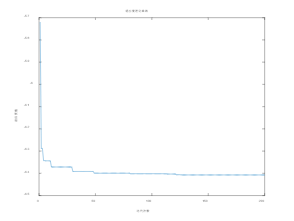
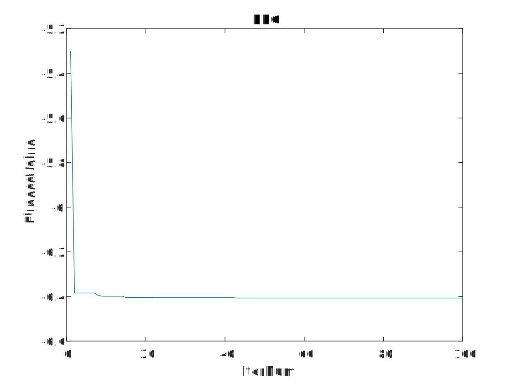
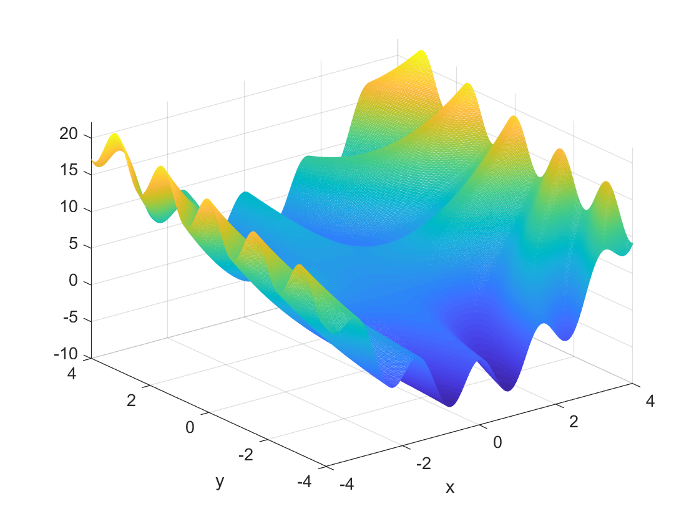

# PSO

```matlab

% 生成坐标范围
x = -4:0.02:4;
y = -4:0.02:4;
N = size(x, 2);
% 粒子群算法参数设置
N = 100;     % 群体粒子个数
D = 2;       % 粒子维数
T = 200;     % 最大迭代次数
c1 = 1.5;    % 学习因子 1
c2 = 1.5;    % 学习因子 2
Wmax = 0.8;  % 惯性权重最大值
Wmin = 0.4;  % 惯性权重最小值
Xmax = 4;    % 位置最大值
Xmin = -4;   % 位置最小值
Vmax = 1;    % 速度最大值
Vmin = -1;   % 速度最小值
```

固定搜索区间，待调节变量为：

群体粒子个数N

最大迭代次数T

学习因子c1,c2

惯性权重最大/小值Wmax/Wmin

速度最大/小值Vmax/Vmin

---

## 群体粒子个数*N*:

影响全局搜索能力和收敛速度。

> 较大的*N* 可能有助于更好地探索搜索空间，但可能增加计算成本。
> 较小的*N* 可能导致搜索过早停止或陷入局部最优。

增加粒子群体个数通常会增加算法的全局搜索能力。更多的粒子意味着更广泛的搜索空间覆盖，有助于发现更多可能的解，尤其是在高维复杂问题中。然而，增加粒子数量也可能增加算法的局部搜索能力。更多的粒子意味着更多的局部信息共享和利用，可以帮助粒子更快地收敛到局部最优解。随着粒子数量的增加，算法的计算复杂度也会增加。更多的粒子意味着更多的位置和速度需要更新，这可能会增加算法的计算成本和时间开销。一般来说，增加粒子数量可以加快算法的收敛速度。更多的粒子意味着更多的搜索信息共享和更新，有助于加速算法收敛到最优解。

| N=80                 | N=90                 | N=110                 | N=120                 |
| -------------------- | -------------------- | --------------------- | --------------------- |
|  |  |  |  |


## 最大迭代次数*T*:

决定了算法运行的时间长度和收敛程度。

> 较大的*T* 可能会增加算法运行时间，但也可能找到更优的解。
> 较小的*T* 可能导致算法过早停止，未找到最优解。

增加最大迭代次数通常会增加算法对搜索空间的探索程度，可以增加算法收敛到最优解的机会。更多的迭代次数意味着算法有更多的机会在搜索空间中进行探索，有助于找到更优的解。然而，增加最大迭代次数也会增加算法的计算成本。每一次迭代都需要更新粒子的位置和速度，这可能会增加算法的计算时间和资源消耗。一般来说，增加最大迭代次数可以加快算法的收敛速度，尤其是在开始阶段。然而，当迭代次数达到一定阈值后，进一步增加迭代次数可能会带来收益递减，因为粒子可能已经趋于稳定或者陷入局部最优解。

| T=180                 | T=190                 | T=210                 | T=220                 |
| --------------------- | --------------------- | --------------------- | --------------------- |
|  |  |  |  |


## 学习因子*c*1 和*c*2:

控制了粒子在个体和社会之间的平衡。

> 较大的值加强相应方向的搜索，但可能导致早熟收敛或震荡。
> c1为个体认知因子，c2为社会认知因子，二者分别调节向对应方向经验的调整程度。

a、个体认知因子（c1）：这个因子影响了粒子在搜索空间中根据个体最优解调整速度的程度。较大的个体认知因子意味着粒子更倾向于沿着自己历史上的最佳方向移动，从而更加关注自身的经验。

b、社会认知因子（c2）：这个因子影响了粒子在搜索空间中根据全局最优解调整速度的程度。较大的社会认知因子意味着粒子更倾向于受到群体中其他粒子的影响，从而更加关注全局的信息。

| c1=1,c2=1             | c1=1,c2=2             | c1=2,c2=1             |
| --------------------- | --------------------- | --------------------- |
|  |  |  |


## 惯性权重*W*max 和*W*min:

控制了惯性对个体和社会的影响。

> 动态平衡全局和局部搜索，影响收敛速度和探索能力。

增加惯性权重范围会使得粒子在搜索空间中保持较大的速度，这可能会导致粒子跳出局部最优解的可能性增加，有助于在搜索过程中更广泛地探索解空间。这意味着算法可能更有可能找到全局最优解，但也可能导致搜索过程中的震荡和不稳定性增加。相反，减少惯性权重范围会使得粒子在搜索空间中保持较小的速度，更加依赖于个体和群体的经验信息进行调整。这可能会导致算法收敛速度加快，但也可能使得算法更容易陷入局部最优解，尤其是在搜索空间复杂或多峰的情况下。

| 0.3-0.7               | 0.3-0.8               | 0.5-0.8               | 0.5-0.8               |
| --------------------- | --------------------- | --------------------- | --------------------- |
|  |  |  |  |


## 速度最大/最小值*V*max 和*V*min:

> 限制了粒子速度的范围，控制了搜索空间的局部性。
> 适当的设置可以避免速度爆炸，保证算法稳定性。

较大的*V*max 可以使粒子具有更大的运动范围，从而有助于跳出局部最优解，促进全局搜索。然而，如果设置过大，可能会导致粒子在搜索过程中过度远离全局最优解，增加搜索过程中的不稳定性和震荡。相反，较小的*V*max 会使粒子的运动范围受限，更依赖于个体和群体的经验信息进行调整，从而可能导致搜索的局部性增加。这可能加快算法的收敛速度，但也可能增加陷入局部最优解的风险，尤其是在搜索空间复杂或多峰的情况下。

*V*min 的设置通常用于避免速度的爆炸性增长，保证粒子的运动稳定性。较小的*V*min 限制了粒子的最小速度，使得粒子不会过度加速，从而保持算法的稳定性。然而，如果设置过小，可能会导致算法陷入局部最优解的可能性增加，因为粒子的运动受到更强的限制，难以跳出局部最优。

| Vmax=0.5,Vmin=-1       | Vmax=1,Vmin=-0.5       | Vmax=2,Vmin=-2          |      |
| ---------------------- | ---------------------- | ----------------------- | ---- |
|  |  |  |      |


---

```matlab
% 最终参数
N = 200;     % 群体粒子个数
D = 2;       % 粒子维数
T = 100;     % 最大迭代次数
c1 = 1.4;    % 学习因子 1
c2 = 1.5;    % 学习因子 2
Wmax = 0.7;  % 惯性权重最大值
Wmin = 0.3;  % 惯性权重最小值
Xmax = 4;    % 位置最大值
Xmin = -4;   % 位置最小值
Vmax = 1;    % 速度最大值
Vmin = -1;   % 速度最小值

Best individual:
   -4.0000    0.7556
Optimal value
   -6.4078
```



